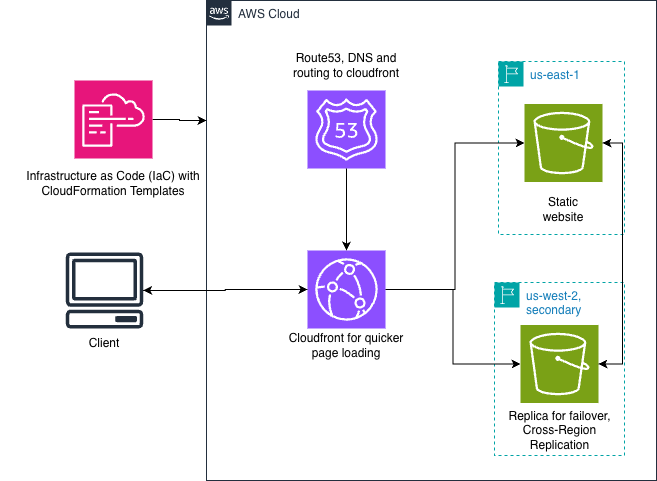

# 🚀 High-Availability Static Website with AWS CloudFormation

This project implements a resilient and scalable static website on AWS using **Infrastructure as Code (IaC)** with CloudFormation. It features a multi-region architecture to ensure high availability and performance.

## 🏗️ Architecture & Technologies
The project follows the **AWS Well-Architected Framework** by utilizing the following services:

* **Amazon S3:** Static content storage across two regions (`us-east-1` and `us-west-2`).
* **Amazon CloudFront:** Global Content Delivery Network (CDN) to serve content with low latency.
* **Origin Access Control (OAC):** Secures S3 buckets by ensuring they are not public; only CloudFront is authorized to access the content.
* **Amazon Route 53:** DNS management using `Alias` records to route traffic to the CloudFront distribution.
* **S3 Origin Groups:** Configured for automatic failover between regions to ensure 99.9% uptime.

## ⚠️ Sandbox Considerations
This project was created in an **AWS Sandbox**, which introduces specific constraints:
* **DNS Routing:** The Route 53 domain routing does not work for public browsing unless you already own the domain. However, the configuration is technically functional and correctly demonstrates the routing logic to CloudFront.
